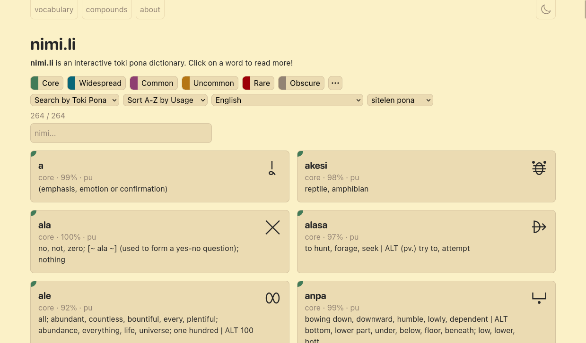
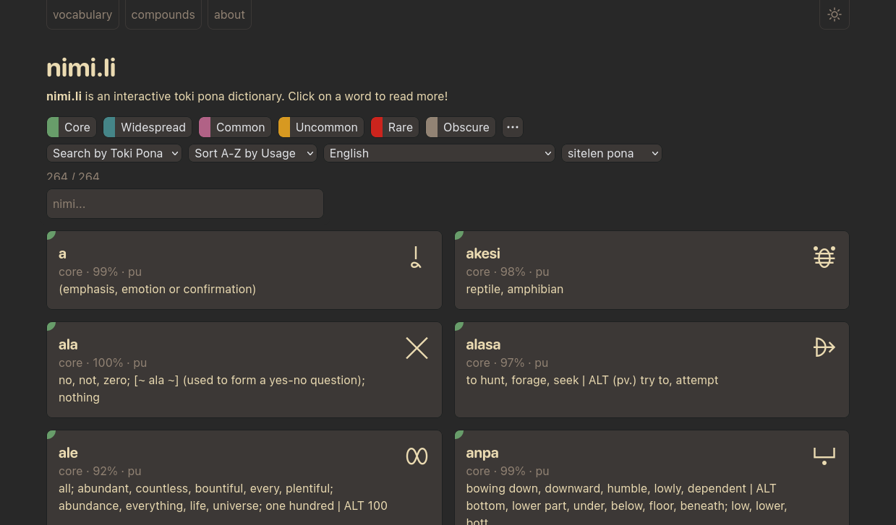

# lipu Nimi.li tawa nasin kule Gruvbox (Gruvbox color scheme for nimi.li)

## lipu Userstyles.world lon ni alasa (install in Userstyles.world)

## kule suno (light theme)

## kule mun (dark theme)

